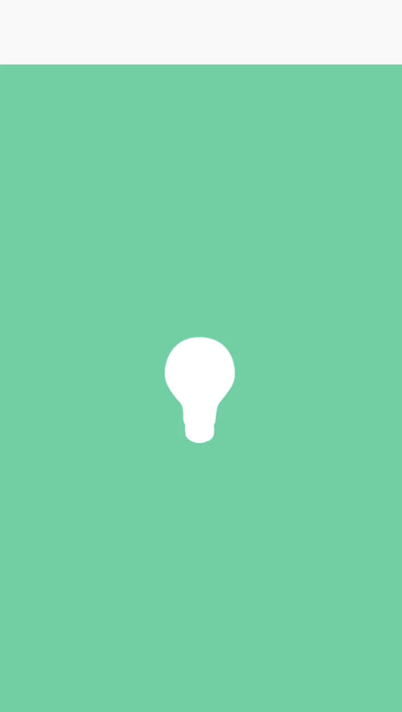
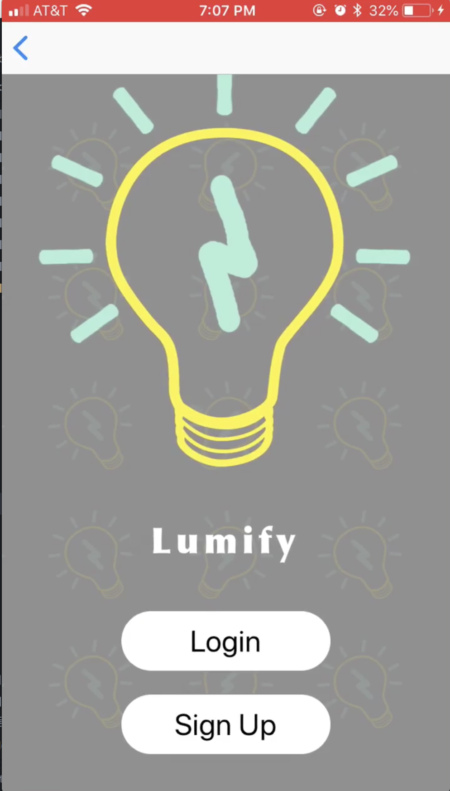
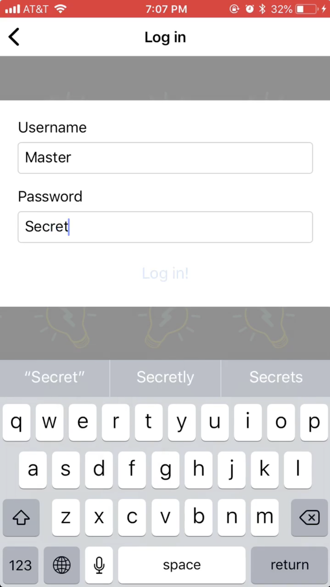
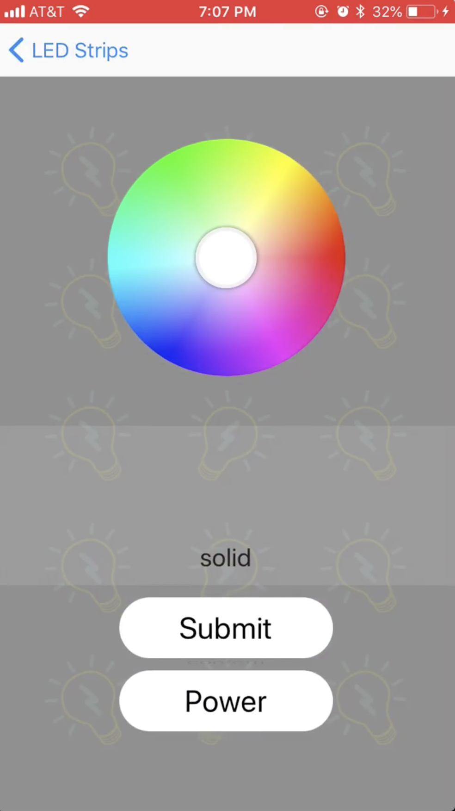

# led_light
mobile app that controls led lights for users: set color, pattern, etc

## Demo
There is a demo of the app in the demo directory. I don't have the led strips with me, so can't show the actual magic happening, but here are the functionalities.

This is the splash screen of the app with animation similar to twitter's.

This is the home page

This is the login page

This is how you control your led strip.
##### power button turns the led light on/off.
##### the color wheel changes the color of led strip.
##### there is a list of options for the patterns of led strip: solid, police, fire, etc

## getting started

#### -register your device at mqtt
#### -set up postgres and have it running

git clone repo:
```
git clone https://github.com/yellgreniff/led_light.git
```
go into led_light/Arduino
```
cd led_light/Arduino
```
open up BitLED.ino and fill in these values:
```C
const char* ssid = ""; //type your WIFI information
const char* password = "";
const char* mqtt_server = "";   //type in your mqtt credentials
const char* mqtt_username = "";
const char* mqtt_password = "";
```
Now go into led_light/server
```
cd ../server
```
open up credentials.js and replace these values:
```JavaScript
module.exports = {
    username: "", //this is mqtt username
    password: "", //mqtt password
    dbuser: "test", //user for postgres
    dbpass: "testing", //password for postgres
    db: "led" //database name
}
```
First install all dependencies for running the server:
```
npm install
```
Run server:
```
node server.js
```
Now go into led_light/ledLight
```
cd ../ledLight
```
open up LoginScreen.js, SignupScreen.js, LedScreen.js and change ip to the wifi ip of your computer
```JavaScript
const ip = '???';
```
Install all dependencies:
```
npm install
```
Start program:
```
npm start
```

